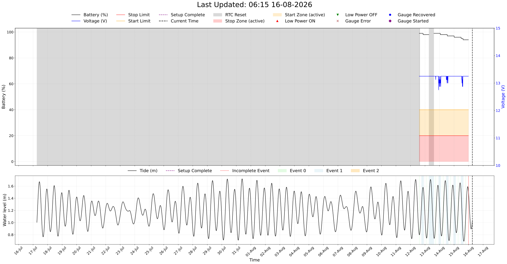
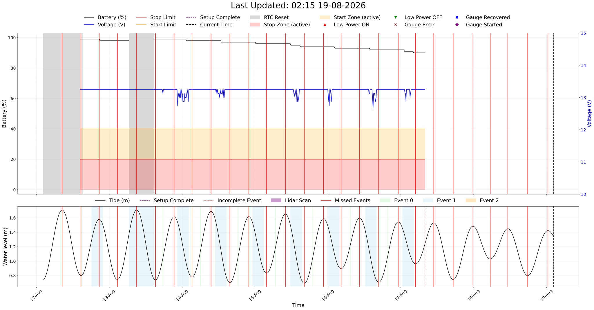
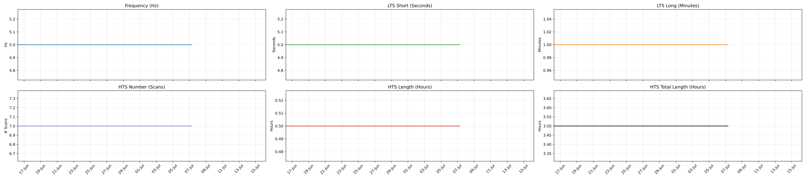
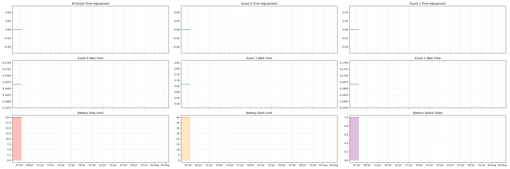

+++
title = "LPD 2"
menu = "main"
slug = "lpd2"
+++

### Current Zephyra Parameters:

### Current Lidar Parameters:

## LPD_2 Currently No Lidar Connected
## Testing on 6 East Roof

### 30‑Day Summary

### 5‑Day Summary

### Lidar Parameters

### Zephyra Parameters

