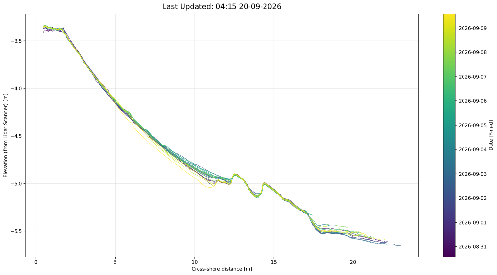
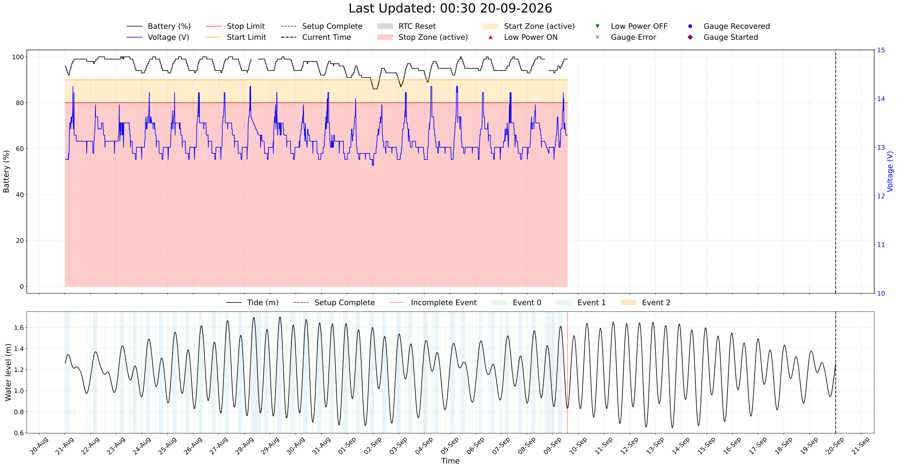
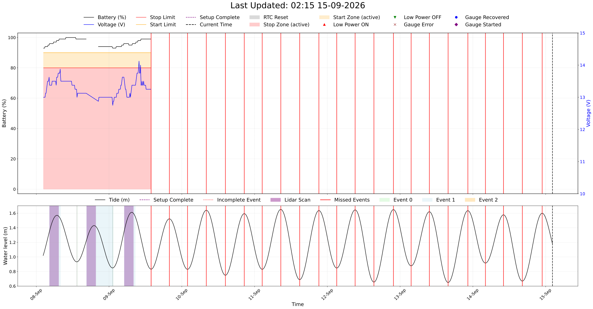
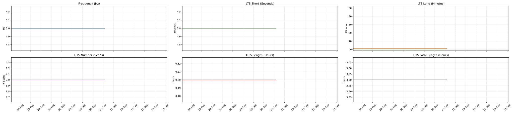
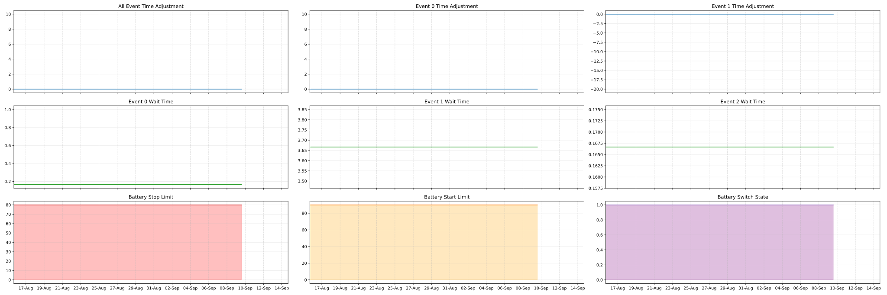

+++
title = "MDV 1"
menu = "main"
slug = "mdv1"
+++

## Located on the island of Dhigelaabadhoo, Maldives

### Zephyra Error Log (Last 30 Days):

### Profile Evolution

### Profile Change

### 30-Day Summary

### 5-Day Summary

### Current Zephyra Parameters:

### Current Lidar Parameters:

### Lidar Parameters

### Zephyra Parameters

